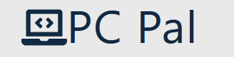
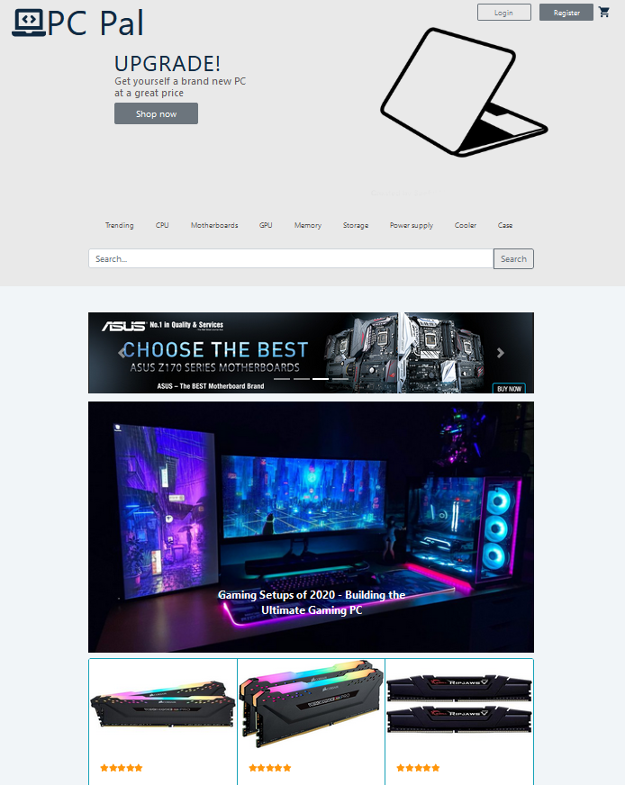
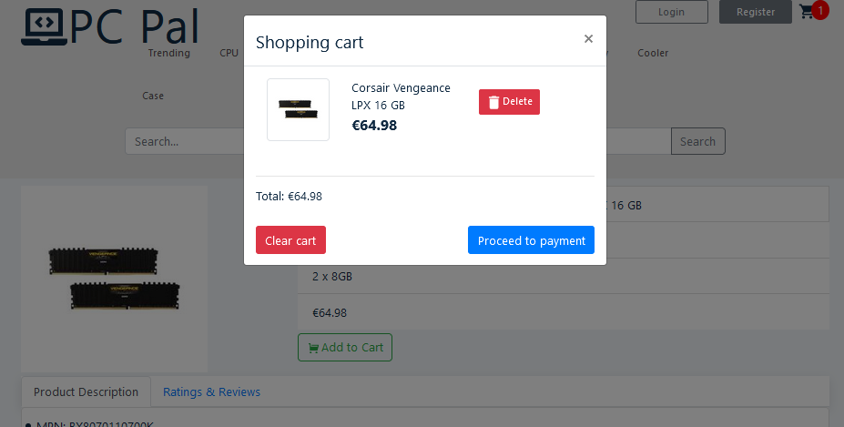
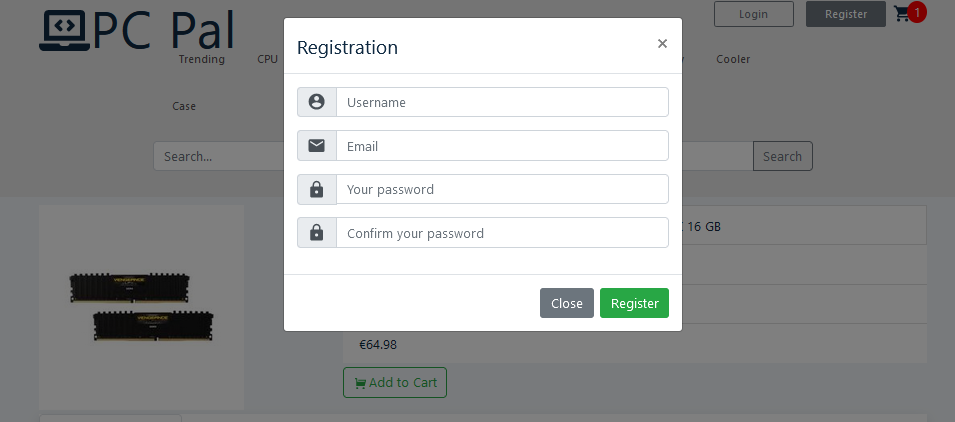

<!-- # PC Pal -->

<!-- Add buttons here -->
<!--  -->

*An e-commerce site, made with Reactjs and Nodejs*

> This is a graded team exercise to showcase PostgreSQL, Express, React, Taiga and Heroku.

# Demo-Preview

<!-- Add a demo for your project -->

<!-- After you have written about your project, it is a good idea to have a demo/preview(**video/gif/screenshots** are good options) of your project so that people can know what to expect in your project. You could also add the demo in the previous section with the product description.

Here is a random GIF as a placeholder.-->

 

Our coders are working hard to bring you an awesome demo.

# Table of contents

<!-- After you have introduced your project, it is a good idea to add a **Table of contents** or **TOC** as **cool** people say it. This would make it easier for people to navigate through your README and find exactly what they are looking for.

Here is a sample TOC(*wow! such cool!*) that is actually the TOC for this README. -->

- [Project Title](#compstore)
- [Demo-Preview](#demo-preview)
- [Table of contents](#table-of-contents)
- [Information](#usage)
- [Project Goals](#project-goals)
- [Screenshots](#screenshots)

# Information
[(Back to top)](#table-of-contents)

<!-- This is optional and it is used to give the user info on how to use the project after installation. This could be added in the Installation section also. -->

This is an online e-commerce store. It is to help a user to search and purchase computer parts to build a pc. It was influenced by [this website pcpartpicker](https://pcpartpicker.com/)

# Project Goals
[(Back to top)](#table-of-contents)

- Project is run agile basis (scrum) and used tool is [Taiga](https://www.taiga.io)
- Build out database with PostgreSQL
- Use Expressjs to run server in Nodejs
- Use Postman to publish [API](https://documenter.getpostman.com/view/5293214/TVemBUm6#01e74731-5bea-4657-849a-d65f0d66d4e4) for team reference
- Build clientside and connect to API with Reactjs
- Deploy site to Heroku for presentation

# Screenshots
[(Back to top)](#table-of-contents)

